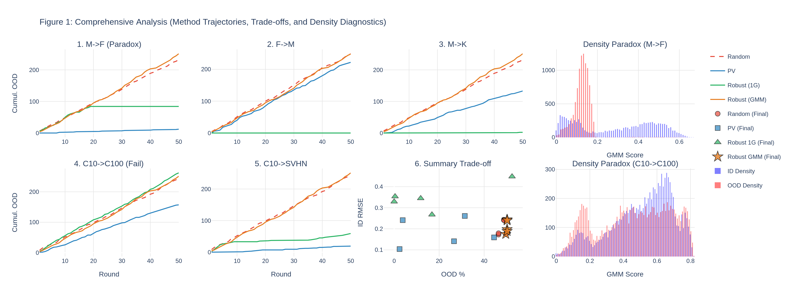

# OOD-Aware Bayesian Active Learning

This repository contains the implementation for Out-of-Distribution (OOD) aware Active Learning using Bayesian Neural Networks. The goal is to mitigate the "Density Paradox" where traditional acquisition functions select OOD samples due to high epistemic uncertainty.

## Results

**Key Finding ("The Density Paradox")**: Standard Bayesian Active Learning (Predictive Variance, PV) often fails in OOD settings because OOD samples exhibit high epistemic uncertainty, tricking the model into selecting them.

**Our Solution**: Robust PV (weighted by GMM density) mitigates this by penalizing points in low-density regions.



*Figure 1: Cumulative OOD queries (top) and Test RMSE (bottom) across 4 experimental settings. Note how Robust PV (Green/Orange) significantly flattens the OOD acquisition curve compared to standard PV (Blue).*

## Project Structure

- `src/`: Core implementation.
  - `models/`: Bayesian layers (Analytic/MFVI), Feature Extractors, and OOD Scorers (Mahalanobis/GMM).
  - `core/`: Active learning loops and acquisition functions.
  - `utils/`: Data loaders for MNIST, Fashion-MNIST, CIFAR-10, SVHN.
- `scripts/`: plotting and analysis tools.
- `results_ood/`: Raw `.npy` metrics.
- `assets/plots/`: Generated figures.
- `main_ood.py`: Main entry point for OOD experiments.

## Setup

1. Install dependencies:
   ```bash
   pip install -r requirements.txt
   ```

2. Run an experiment:
   ```bash
   # Example: MNIST (ID) vs Fashion-MNIST (OOD) with Robust PV
   python main_ood.py --id_dataset mnist --ood_dataset fashion_mnist --acquisition robust_pv --rounds 50
   ```

## Key Components

- **Robust Predictive Variance (Robust PV)**: Weights standard PV by an In-Distribution density score (Mahalanobis or GMM).
- **GMM Scorer**: Uses a Gaussian Mixture Model to better capture complex ID distributions compared to a single Gaussian.
